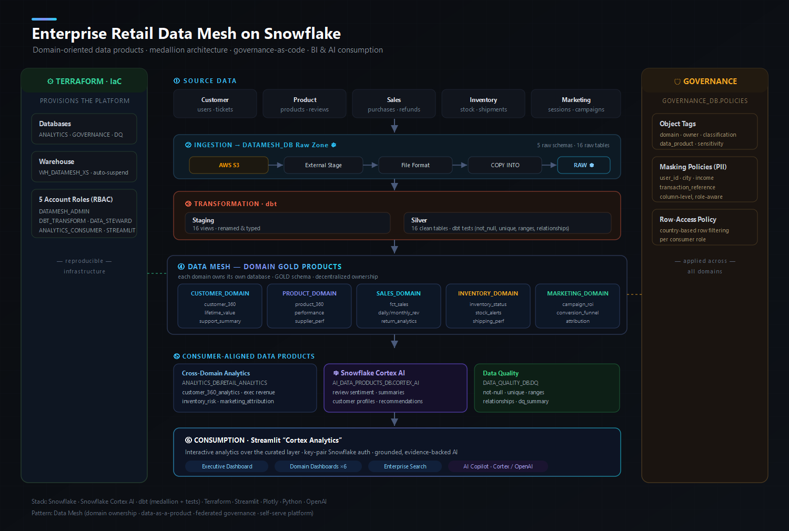
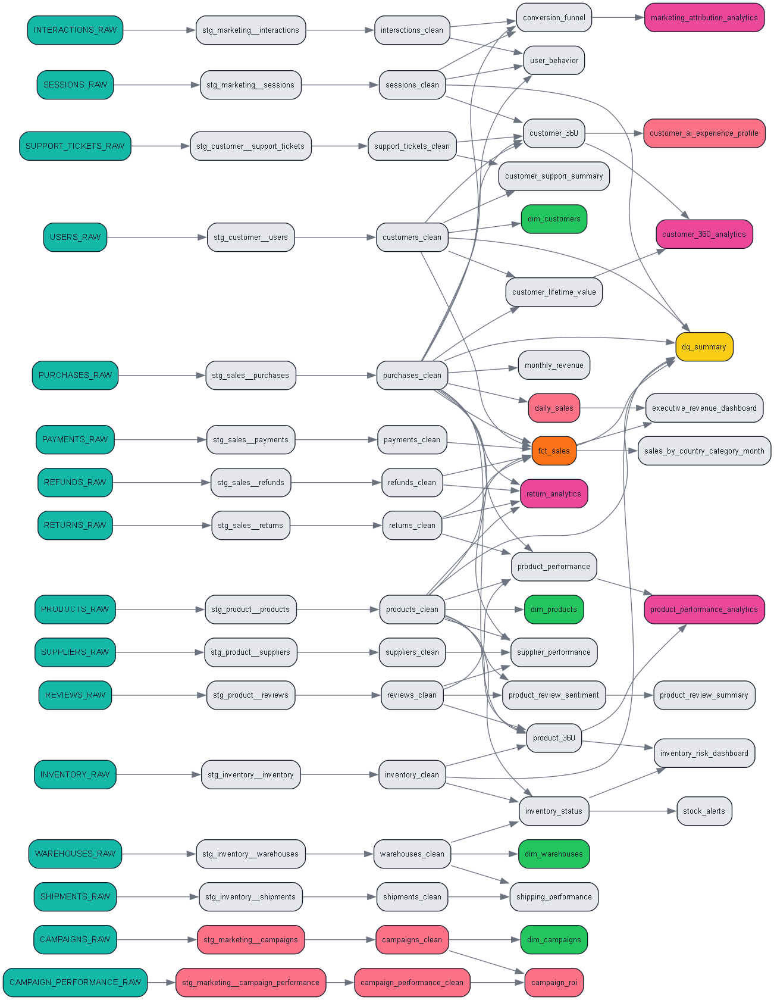
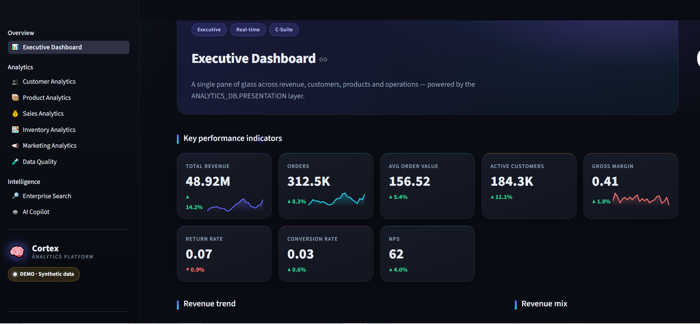

<div align="center">

# 🏬 Enterprise Retail Data Mesh on Snowflake

### Domain-oriented data products · medallion architecture · governance-as-code · BI & AI consumption

A full, end-to-end **data platform** built the way a modern data team would build it:
five business domains each owning their own data products, transformed with **dbt**,
provisioned with **Terraform**, governed with **tags · masking · row-access policies**,
enriched with **Snowflake Cortex AI**, and consumed through a **Streamlit** analytics app.

<br/>


</div>

---

## 🏗️ Architecture



The platform follows **data mesh** principles end to end:

| Principle | How it's implemented here |
|---|---|
| **Domain ownership** | Each domain (customer, product, sales, inventory, marketing) gets its **own Snowflake database** with a `GOLD` schema |
| **Data as a product** | Domains publish curated, tested gold tables (`customer_360`, `fct_sales`, `campaign_roi`, …) |
| **Self-serve platform** | **Terraform** provisions databases, warehouse, and RBAC roles reproducibly |
| **Federated governance** | Central `GOVERNANCE_DB` holds object tags, PII masking, and row-access policies applied across all domains |

---

## 🔄 Data Flow

```
AWS S3  →  External Stage  →  File Format  →  COPY INTO  →  DATAMESH_DB (Raw)
                                                                  │
                                          dbt: staging (views) → silver (tables, tested)
                                                                  │
                  ┌───────────────┬───────────────┬──────────────┼───────────────┬────────────────┐
            CUSTOMER_DOMAIN  PRODUCT_DOMAIN   SALES_DOMAIN   INVENTORY_DOMAIN  MARKETING_DOMAIN   (GOLD)
                  └───────────────┴───────────────┴──────────────┴───────────────┴────────────────┘
                                                                  │
                        Cross-domain analytics · Snowflake Cortex AI · Data Quality
                                                                  │
                                       Streamlit “Cortex Analytics” (9 dashboards + AI Copilot)
```

---

## 📦 What's in this repo

```
.
├── sql/data_mesh_setup.sql     # full Snowflake build: raw → gold, governance, DQ, AI (3.8k lines)
├── dbt/                        # dbt project — medallion + domain data products + Cortex AI models
│   ├── models/staging         #   16 staging views (renamed & typed)
│   ├── models/silver          #   16 clean tables + dbt tests (not_null, unique, ranges, relationships)
│   ├── models/marts/<domain>  #   gold data products, materialized into each domain database
│   ├── models/marts/cross_domain  # customer_360_analytics, exec revenue, attribution …
│   ├── models/ai              #   Snowflake Cortex AI products (sentiment, summaries, profiles)
│   └── models/dq              #   data-quality summary
├── terraform/                 # IaC — databases, warehouse, 5 RBAC roles
├── app/                       # Streamlit "Cortex Analytics" — 9 dashboards + grounded AI Copilot
└── docs/                      # architecture diagram, dbt lineage, screenshots
```

---

## 🧱 The Data Mesh (dbt)

Each domain's gold models are materialized into a **dedicated database** via dbt config —
this is what makes it a true mesh rather than just folders:

```yaml
marts:
  customer:  { +database: CUSTOMER_DOMAIN_DB,  +schema: GOLD }
  product:   { +database: PRODUCT_DOMAIN_DB,   +schema: GOLD }
  sales:     { +database: SALES_DOMAIN_DB,     +schema: GOLD }
  inventory: { +database: INVENTORY_DOMAIN_DB, +schema: GOLD }
  marketing: { +database: MARKETING_DOMAIN_DB, +schema: GOLD }
```

**Layers:** `staging` (views) → `silver` (clean, tested tables) → `marts` (domain gold) →
`cross_domain` (consumer-aligned views in `ANALYTICS_DB`).



---

## 🤖 Snowflake Cortex AI

Three AI data products run **in-database** with native Cortex functions:

| Model | Cortex function |
|---|---|
| `product_review_sentiment` | `SNOWFLAKE.CORTEX.SENTIMENT(review_text)` |
| `product_review_summary` | `SNOWFLAKE.CORTEX.COMPLETE(model, prompt)` over aggregated reviews |
| `customer_ai_experience_profile` | `SNOWFLAKE.CORTEX.COMPLETE(model, prompt)` — constrained segmentation |

Each model has a **`use_cortex` toggle** — Cortex by default, with a deterministic
rule-based fallback for accounts/regions where Cortex isn't enabled:

```bash
dbt build                               # real Snowflake Cortex (default)
dbt build --vars 'use_cortex: false'    # deterministic fallback
```

---

## 🛡️ Governance (in `sql/` + central `GOVERNANCE_DB`)

- **Object tags** — `domain`, `owner`, `classification`, `data_product`, `sensitivity`
- **Masking policies (PII)** — `user_id`, `city`, `income_level`, `transaction_reference` (column-level, role-aware)
- **Row-access policy** — country-based row filtering per consumer role
- **RBAC** — 5 roles: `DATAMESH_ADMIN`, `DBT_TRANSFORM`, `DATA_STEWARD`, `ANALYTICS_CONSUMER`, `STREAMLIT_APP`

---

## 🖥️ Consumption — Streamlit "Cortex Analytics"

A polished BI app over the curated layer (`app/`):

- **9 pages** — Executive, Customer, Product, Sales, Inventory, Marketing, Data Quality, Enterprise Search, AI Copilot
- **Grounded AI Copilot** — answers cite real rows; shows supporting tables + charts
- **LIVE ↔ DEMO** — runs on realistic synthetic data with no credentials; switches to live Snowflake + OpenAI when `.env` is set
- **Key-pair Snowflake auth**, parameterised queries, secrets only from env vars



```bash
cd app
python -m venv .venv && source .venv/bin/activate   # Windows: .venv\Scripts\activate
pip install -r requirements.txt
streamlit run app.py            # DEMO mode; add .env (see .env.example) to go LIVE
```

---

## 🚀 Reproduce it

1. **Provision** infra — `cd terraform`, copy `terraform.tfvars.example` → `terraform.tfvars`, `terraform apply`
2. **Build the warehouse SQL** — run `sql/data_mesh_setup.sql` (raw, governance, DQ scaffolding)
3. **Transform** — `cd dbt`, set `profiles.example.yml` → `profiles.yml`, `dbt deps && dbt build`
4. **Consume** — `cd app`, `streamlit run app.py`

---

## 🧰 Stack

**Snowflake** · **Snowflake Cortex AI** · **dbt** (medallion + tests) · **Terraform** ·
**Streamlit** · **Plotly** · **Python** · **OpenAI**

> Synthetic retail data is used throughout — no real or proprietary data is included.
> All credentials load from environment variables; secrets are git-ignored.

---

<div align="center">

**Baba Fakruddin Shaik** · Data &amp; Analytics Engineer

[](https://shaikfakruddin2018.github.io)
[](https://linkedin.com/in/contactbaba-fakruddin-shaik)

</div>
